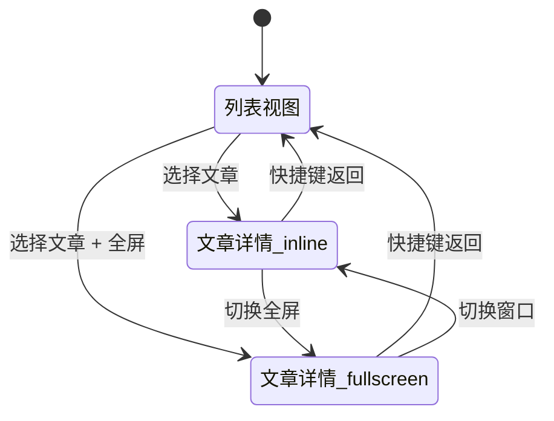
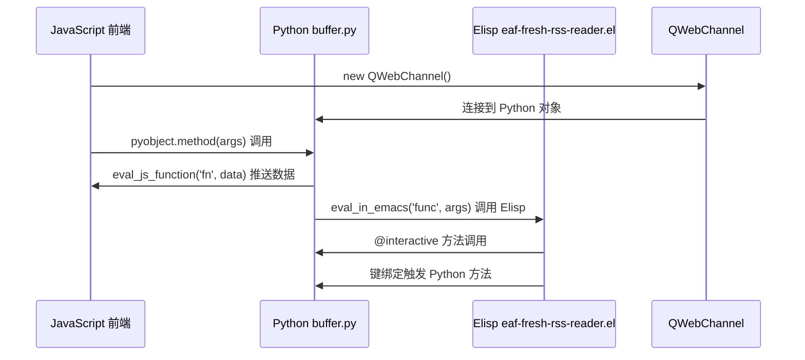

# Fresh RSS Reader 架构设计文档

创建日期：2026-09-09
项目：fresh-rss-reader
文档类型：架构设计
状态：草案，待实现前确认

---

## 1. 项目概述

### 1.1 目标

fresh-rss-reader 是 EAF RSS Reader 模块的重写版本，旨在解决原版已停止维护的问题，提供更合理、更稳定的实现，并与父项目 EAF 保持同步/兼容。

### 1.2 设计原则

- **基于 EAF 运行环境**：沿用 EAF 的 Buffer 体系、QWebEngine、前端桥接机制
- **兼容 Doom Emacs 设计原则**：模块加载方式、键绑定协调、配置组织方式、主题适配
- **保持合理的范围**：聚焦核心功能，避免过度扩展
- **清晰的交互路径**：特别是解决原版"打开文章后缺少返回命令"的问题
- **现代前端技术**：采用 Vue 3 + Composition API，提升代码组织和可维护性

---

## 2. 运行环境

### 2.1 EAF 依赖

- **EAF 核心**：核心 Buffer 体系 (core/buffer.py, core/webengine.py)
- **Python**：使用系统安装的 Python 3（通过 `eaf-python-command` 配置）
- **QWebEngine**：用于加载和显示前端 Web 视图
- **QWebChannel**：Python ↔ JavaScript 双向通信桥梁

### 2.2 模块注册

沿用 EAF 模块注册模式：

```elisp
;; eaf-fresh-rss-reader.el 中
(add-to-list 'eaf-app-binding-alist '("fresh-rss-reader" . eaf-fresh-rss-reader-keybinding))
(add-to-list 'eaf-app-module-path-alist '("fresh-rss-reader" . eaf-fresh-rss-reader-module-path))
```

### 2.3 Doom Emacs 兼容性

- **模块加载**：可被 Doom Emacs 采用统一的插件加载模式管理
- **键绑定**：设计时考虑与 Doom Emacs Evil 键绑定体系的协调，避免冲突
- **配置组织**：能够自然地接入 Doom Emacs 的配置组织方式（如 `config.el` 风格加载）
- **主题适配**：从 Emacs 主题获取颜色/字体设置，与 Doom 的视觉风格一致

---

## 3. 范围边界

### 3.1 核心必须功能（本版必须实现）

1. **RSS Feed 列表管理**
   - 添加 feed
   - 移除 feed
   - 展示 feed 列表
   - Feed 基本信息展示（标题、订阅地址等）

2. **文章列表展示**
   - 展示当前选中 feed 的文章列表
   - 文章基本信息展示（标题、作者、时间、摘要等）
   - 文章已读/未读状态展示

3. **文章内容阅读**
   - 打开文章链接进行阅读
   - 文章内容展示

4. **已读标记**
   - 标记文章为已读
   - 已读状态在文章列表中展示

5. **OPML 导入/导出**
   - 从 OPML 文件导入 feed 列表
   - 将当前 feed 列表导出为 OPML 文件

### 3.2 可选功能（后续版本考虑）

- 文章保存/收藏
- 全文抓取（content extraction）
- 搜索功能
- 标签/分类
- 过滤规则
- 离线缓存
- 阅读历史/同步
- 阅读进度追踪

### 3.3 旧 rss-reader

- 旧版 rss-reader 可完全舍弃，fresh-rss-reader 是重新设计的独立实现

---

## 4. 交互模型

### 4.1 整体布局

- **列表 + 详情同章**：复合布局，列表和详情在同一个主视图内，根据需要进行显示切换
- **允许全屏详情**：文章可以全屏显示，方便专注阅读
- **快捷键返回**：通过快捷键返回列表，这是主要返回手段

### 4.2 视图切换逻辑

```
+------------------+------------------+
|                  |                  |
|    Feed List     |   Article List   |
|                  |                  |
|                  +------------------+
|                  |                  |
|                  |   Article View   |
|                  |   (inline)       |
|                  |                  |
+------------------+------------------+

或者全屏模式：

+----------------------------------+
|                                  |
|         Article View             |
|         (fullscreen)             |
|                                  |
+----------------------------------+
```

- 有当前文章时展示详情；详情可以是"列表旁 inline"或"全屏"
- 全屏状态下，快捷键触发 `closeArticle()`，恢复为列表视图
- 返回路径由快捷键驱动，不依赖窗口去猜当前在哪个 buffer

### 4.3 交互语义

- 快捷键是主要返回手段
- 全屏详情状态下，快捷键返回的目标是列表视图；从全屏退出后仍可在列表视图中继续浏览
- 文章详情不作为独立窗口/独立页面看待，而是在同一视图体系内切换显示状态

### 4.4 设计意图

通过"列表 + 详情同章 + 允许全屏 + 快捷键返回"的模型，避免原版 rss-reader 中因打开文章后缺少明确返回命令而导致的卡顿/迷失问题。用户在任何详情状态下都应能通过快捷键清楚地回到 feed/news list。

---

## 图表

### 4.5 系统架构图

```mermaid
graph TD
    A[Elisp 层] -->|eval_in_emacs| B[Python 层]
    B -->|eval_js_function| C[JavaScript 层]
    C -->|QWebChannel| B
    B -->|@pyqtSlot| C
    
    subgraph "EAF 框架"
        A
        B
    end
    
    subgraph "fresh-rss-reader"
        B
        C
    end
    
    A -->|键绑定 alist| B
    C -->|Vue 组件| D[视图层]
```

### 4.6 视图切换流程



---

## 5. 前端架构

### 5.1 技术选型

- **框架**：Vue 3
- **API 风格**：Composition API（`<script setup>`）
- **状态管理**：轻量集中模块（reactive 对象 + 函数导出），后续可升级为 Pinia
- **构建工具**：Vite
- **CSS**：自定义样式，主题适配从 Emacs 主题获取

### 5.2 选择 Composition API 的理由

- 逻辑复用：相关的逻辑放在一起，而不是分散在 `data`、`methods`、`computed`、`watch` 中
- 复杂状态管理：当组件变得复杂时，Composition API 能更好地组织代码
- 自定义 Hooks：可以创建可复用的逻辑函数
- 更适合后续扩展和维护

### 5.3 组件结构

```
src/
├── main.js               # Vue 3 入口
├── App.vue               # 根组件（视图切换：列表 / 详情 / 全屏）
├── state/
│   └── useAppState.js    # 集中状态模块（reactive + 导出函数）
├── components/
│   ├── FeedList.vue      # feed 列表组件
│   ├── ArticleList.vue   # 文章列表组件
│   ├── ArticleView.vue   # 文章详情（支持全屏切换）
│   └── ArticleMeta.vue   # 文章元信息小部件（可选）
├── services/
│   └── qweb.js           # QWebChannel 封装和 pyobject 初始化
└── styles/
    └── main.css          # 基础样式 + 主题适配
```

### 5.4 组件职责

#### App.vue（根组件）

- 根据状态决定显示区域：列表 + 详情 还是 仅详情全屏
- 整合快捷键处理（从 services 接收）
- 协调子组件的显示切换

#### FeedList.vue

- 展示 feeds，点击切换当前 feed
- 已读状态视觉反馈
- feed 数量、未读数量展示

#### ArticleList.vue

- 展示当前 feed 的文章列表
- 点击切换当前文章、滚动保持可见、已读高亮
- 文章标题、作者、时间、摘要展示

#### ArticleView.vue

- 展示文章标题、作者、时间、描述、链接
- 支持"窗口模式"和"全屏模式"
- 全屏切换由状态控制，Esc/快捷键返回
- 文章内容渲染

#### useAppState.js（状态模块）

- `feedsList: []`
- `currentFeedIndex: -1`
- `currentArticleIndex: -1`
- `articleViewMode: 'inline' | 'fullscreen'`
- 提供改变状态的函数（如 `selectFeed(index)`、`openArticle(index)`、`closeArticle()`）

#### services/qweb.js

- 统一初始化 QWebChannel，不分散在各组件
- 导出 `pyobject` 供组件使用
- 封装常用的 Python 方法调用

---

## 6. Python 后端架构

### 6.1 Buffer 继承结构

```
core/buffer.py (Buffer - 抽象基类)
    └── core/webengine.py (BrowserBuffer)
            └── buffer.py (AppBuffer - fresh-rss-reader 专用)
```

### 6.2 AppBuffer 职责

- **Feed 管理**
  - 添加 feed
  - 移除 feed
  - 刷新 feed（抓取/解析线程）
  - feed 状态存储

- **文章管理**
  - 文章已读标记（状态落地）
  - 文章状态存储
  - 推送文章列表到前端

- **OPML 处理**
  - OPML 导入
  - OPML 导出

- **前端通信**
  - 暴露 `pyqtSlot` 方法给前端调用
  - 通过 `eval_js_function` 推送数据到前端

- **Elisp 通信**
  - 通过 `eval_in_emacs` 调用 Elisp 方法
  - 响应 Elisp 端的 `@interactive` 方法调用

### 6.3 方法命名约定

方法名应与交互语义一致，方便后续绑定快捷键和状态更新：

- `open_article` → 打开当前文章
- `close_article` → 返回列表
- `next_article` / `prev_article` → 文章导航
- `select_feed` / `next_feed` / `prev_feed` → feed 导航
- `toggle_fullscreen` → 在 inline 与全屏间切换
- `mark_read` → 已读标记
- `add_feed` → 添加 feed
- `remove_feed` → 移除 feed
- `refresh_feed` → 刷新当前 feed
- `import_opml` → 导入 OPML
- `export_opml` → 导出 OPML

### 6.4 数据存储

- Feed 列表和文章列表存储在 JSON 文件中（沿用 EAF RSS Reader 模式）
- 可选：支持 SQLite 数据库存储（用于更复杂的查询和状态管理）
- 存储位置：Emacs 配置目录下的 rss-reader 子目录

---

## 7. 通信架构

### 7.1 通信链路

```
Elisp (eaf-fresh-rss-reader.el)
    │
    ├── eval_in_emacs() ← Python 调用 Elisp
    │   例：eval_in_emacs("eaf--show-message", [message])
    │
    ├── @interactive ← Elisp 调用 Python 方法
    │   例：(defun eaf-open-rss-link (feed-link url)
    │          (interactive "M[EAF/browser] URL: "))
    │
    └── 键绑定 alist ← Elisp 定义键绑定映射到 Python 方法名
        例：("f" . "open_article")

Python (buffer.py)
    │
    ├── @QtCore.pyqtSlot 装饰的方法 ← JS 通过 QWebChannel 调用
    │   例：@QtCore.pyqtSlot(int, int, str)
    │        def mark_article_as_read(self, feedlink_index, article_index, link):
    │
    ├── eval_js_function() ← Python 调用 JS
    │   例：self.buffer_widget.eval_js_function('updateFeedsList', feeds)
    │
    └── eval_in_emacs() ← Python 调用 Elisp
        例：eval_in_emacs("eaf-open-rss-link", [feed_link, link])

JavaScript (src/services/qweb.js)
    │
    ├── new QWebChannel(qt.webChannelTransport, channel => {
    │       window.pyobject = channel.objects.pyobject;
    │       // 或导出到模块
    │   });
    │
    └── pyobject.methodName(args)  // 调用 Python 的 pyqtSlot 方法
```

### 7.2 通信原则

1. **前端统一初始化 QWebChannel**：通过 `services/qweb.js` 集中初始化，不分散在各组件
2. **方法命名与交互语义一致**：便于后续绑定快捷键和状态更新
3. **状态改变通过 Vue 响应式系统**：Python 推送数据到前端后，由 Vue 自动更新视图
4. **避免直接操作 DOM**：除非必要，尽量通过状态改变来驱动视图更新

---

## 图表

### 7.3 通信数据流



### 7.4 状态更新循环

```mermaid
flowchart TD
    A[用户交互] --> B[Vue 状态改变]
    B --> C{需要 Python 处理?}
    C -->|是| D[调用 pyobject.slotMethod()]
    D --> E[Python 处理后返回]
    E --> F[更新 Vue 状态]
    F --> G[Vue 自动更新视图]
    C -->|否| G
```

---

## 8. 状态管理

### 8.1 状态模型

```javascript
// src/state/useAppState.js
import { reactive, readonly } from 'vue'

export const useAppState = () => {
  const state = reactive({
    feedsList: [],
    currentFeedIndex: -1,
    currentArticleIndex: -1,
    articleViewMode: 'inline',  // 'inline' | 'fullscreen'
    feedsLinkList: [],
    // 可能的扩展状态
    // selectedArticle: null,
    // unreadCount: 0,
  })

  // 状态改变函数
  function selectFeed(index) { ... }
  function selectArticle(index) { ... }
  function openArticle() { ... }
  function closeArticle() { ... }
  function toggleFullscreen() { ... }
  function markArticleRead() { ... }
  function addFeed(feed) { ... }
  function removeFeed(index) { ... }

  return {
    state: readonly(state),
    selectFeed,
    selectArticle,
    openArticle,
    closeArticle,
    toggleFullscreen,
    markArticleRead,
    addFeed,
    removeFeed,
  }
}
```

### 8.2 状态改变原则

- 所有状态改变都通过明确的函数进行
- 函数内部可以调用 Python 方法（通过 pyobject）
- Python 返回数据后更新状态，Vue 自动更新视图
- 避免直接修改 state，保持状态变化可追踪

### 8.3 与 Python 的状态同步

- **前端 → Python**：通过 `pyobject.slotMethod()` 调用
- **Python → 前端**：通过 `eval_js_function()` 推送数据，前端更新状态
- **已读状态**：前端标记后，Python 落地存储，必要时推送更新后的列表

---

## 9. 快捷键设计

### 9.1 键绑定注册

在 Elisp 中通过 `defcustom` 定义键绑定：

```elisp
(defcustom eaf-fresh-rss-reader-keybinding
  '((\"f\" . \"open_article\")
    (\"q\" . \"close_article\")
    (\"j\" . \"next_article\")
    (\"k\" . \"prev_article\")
    (\"n\" . \"next_feed\")
    (\"p\" . \"prev_feed\")
    (\"F\" . \"toggle_fullscreen\")
    (\"m\" . \"mark_read\")
    (\"A\" . \"add_feed\")
    (\"R\" . \"remove_feed\")
    (\"g\" . \"refresh_feed\")
    (\"i\" . \"import_opml\")
    (\"o\" . \"export_opml\")
    (\"-\" . \"zoom_out\")
    (\"=\" . \"zoom_in\")
    (\"r\" . \"refresh_web_page\")
    (\"u\" . \"jump_to_unread\")
    (\"C-c C-r\" . \"reload_index\")
    (\"<f12>\" . \"open_devtools\"))
  \"The keybinding of EAF Fresh RSS Reader.\"
  :type 'cons)
```

### 9.2 键绑定语义

| 快捷键 | 方法 | 说明 |
|--------|------|------|
| `f` | `open_article` | 打开当前文章 |
| `q` | `close_article` | 返回列表（主要返回命令） |
| `j` | `next_article` | 下一篇文章 |
| `k` | `prev_article` | 上一篇文章 |
| `n` | `next_feed` | 下一个 feed |
| `p` | `prev_feed` | 上一个 feed |
| `F` | `toggle_fullscreen` | 切换全屏/inline |
| `m` | `mark_read` | 标记当前文章为已读 |
| `A` | `add_feed` | 添加 feed |
| `R` | `remove_feed` | 移除当前 feed |
| `g` | `refresh_feed` | 刷新当前 feed |
| `i` | `import_opml` | 导入 OPML |
| `o` | `export_opml` | 导出 OPML |
| `-` | `zoom_out` | 缩小 |
| `=` | `zoom_in` | 放大 |
| `r` | `refresh_web_page` | 刷新页面 |
| `u` | `jump_to_unread` | 跳转到未读文章 |

### 9.3 返回路径的快捷键

- **`q`**：主要返回命令，从全屏/详情返回列表
- **设计意图**：任何时候按 `q` 都应该能清楚地回到 feed/news list
- **实现方式**：基于应用状态，而不是窗口位置
  - 如果在全屏详情，`q` → 退出全屏、回到列表
  - 如果在列表 + inline 详情，`q` → 隐藏详情、聚焦列表

### 9.4 Doom Emacs 兼容性考虑

- 避免与 Doom Evil 常用快捷键冲突
- 可配置化：允许用户自定义键绑定
- 如果与 Doom 键绑定冲突，提供合理的默认值或警告

---

## 10. 主题适配

### 10.1 从 Emacs 获取主题信息

```python
# buffer.py 中
theme_mode = get_emacs_theme_mode()  # 'light' | 'dark'
theme_foreground_color = get_emacs_theme_foreground()
theme_background_color = get_emacs_theme_background()
```

### 10.2 传递给前端

```python
# 初始化时传递主题颜色
self.buffer_widget.eval_js_function('initTheme', {
    'mode': theme_mode,
    'foreground': theme_foreground_color,
    'background': theme_background_color,
})
```

### 10.3 前端主题适配

```css
/* styles/main.css */
:root {
  --bg-color: #1E1E1E;
  --fg-color: #FFFFFF;
  --select-color: #333333;
  --read-color: #AAAAAA;
  --line-color: #CCCCCC;
}

/* 根据 Emacs 主题动态调整 */
```

---

## 11. 模块注册和加载

### 11.1 Elisp 模块注册

```elisp
;; eaf-fresh-rss-reader.el

;; 模块路径
(setq eaf-fresh-rss-reader-module-path 
      (concat (file-name-directory load-file-name) "buffer.py"))
(add-to-list 'eaf-app-module-path-alist 
             '("fresh-rss-reader" . eaf-fresh-rss-reader-module-path))

;; 键绑定
(add-to-list 'eaf-app-binding-alist 
             '("fresh-rss-reader" . eaf-fresh-rss-reader-keybinding))

;; 可自定义选项
(defcustom eaf-fresh-rss-reader-split-horizontally t
  "Split web page horizontally."
  :type 'boolean)

(defcustom eaf-fresh-rss-reader-refresh-time "600"
  "The default feed refresh time."
  :type 'int)

(defcustom eaf-fresh-rss-reader-phone-agent-list nil
  "Some site can't show content complete."
  :type 'list)
```

### 11.2 加载函数

```elisp
(defun eaf-open-fresh-rss-reader ()
  "Open EAF Fresh RSS Reader"
  (interactive)
  (let ((inhibit-message t))
    (eaf-open default-directory "fresh-rss-reader")))
```

---

## 12. 文件结构（完整）

```
fresh-rss-reader/
├── buffer.py                     # AppBuffer 实现（Python 后端）
├── eaf-fresh-rss-reader.el       # Elisp 配置、键绑定、模块注册
├── package.json                  # 前端依赖 + 脚本
├── vite.config.js                # Vite 配置
├── index.html                    # 入口 HTML
├── src/
│   ├── main.js                   # Vue 3 入口
│   ├── App.vue                   # 根组件
│   ├── state/
│   │   └── useAppState.js        # 集中状态模块
│   ├── components/
│   │   ├── FeedList.vue          # feed 列表
│   │   ├── ArticleList.vue       # 文章列表
│   │   ├── ArticleView.vue       # 文章详情
│   │   └── ArticleMeta.vue       # 文章元信息（可选）
│   ├── services/
│   │   └── qweb.js               # QWebChannel 封装
│   └── styles/
│       └── main.css              # 基础样式
└── dist/                         # Vite 构建产物（由 Python 加载）
    ├── index.html
    ├── assets/
    │   ├── js/
    │   └── css/
    └── ...
```

---

## 13. 实现阶段（建议）

### 13.1 第一阶段：基础架构

1. 初始化 Vue 3 + Vite 项目
2. 建立组件骨架（App.vue, FeedList.vue, ArticleList.vue, ArticleView.vue）
3. 实现 QWebChannel 封装和状态模块
4. Python Buffer 基础结构

### 13.2 第二阶段：核心功能

1. Feed 列表管理（添加、移除、展示）
2. 文章列表展示和导航
3. 文章阅读（全屏/inline 切换）
4. 已读标记
5. 快捷键绑定和返回路径

### 13.3 第三阶段：数据管理

1. Feed 刷新（抓取/解析线程）
2. 数据存储（JSON/数据库）
3. OPML 导入/导出

### 13.4 第四阶段：优化和兼容

1. 主题适配
2. Doom Emacs 兼容性优化
3. 错误处理和边界情况
4. 性能优化

---

## 14. 验证标准

### 14.1 功能验证

- [ ] 可以添加和移除 feed
- [ ] 可以显示 feed 列表和文章列表
- [ ] 可以打开文章阅读
- [ ] 可以切换全屏/inline 模式
- [ ] 快捷键 `q` 可以从任何详情状态返回列表
- [ ] 已读标记在列表中正确展示
- [ ] OPML 可以导入和导出

### 14.2 兼容性验证

- [ ] 可以被 EAF 正常加载和启动
- [ ] 与 Doom Emacs 兼容（键绑定、加载方式、主题）
- [ ] Python ↔ JavaScript 通信正常
- [ ] Python ↔ Elisp 通信正常

### 14.3 稳定性验证

- [ ] 无论在列表、文章列表、文章详情、全屏状态下，快捷键都能正常工作
- [ ] 状态改变后视图正确更新
- [ ] 错误情况（无 feed、无文章、空链接等）有合理处理

---

## 15. 风险和注意事项

### 15.1 已知风险

1. **Vue 3 迁移**：虽然 Vue 3 与 EAF 兼容，但需要确保构建配置正确
2. **状态复杂性**：随着功能增加，状态管理可能变复杂（初期保持简单）
3. **主题适配**：不同 Emacs 主题下的颜色适配可能需要调整

### 15.2 注意事项

1. **不要直接操作 DOM**：尽量通过状态改变驱动视图更新
2. **错误处理**：空列表、无效索引、空链接等情况要有合理处理
3. **性能**：文章列表较大时要考虑虚拟滚动或其他优化
4. **测试**：核心功能应该有基本的测试覆盖

---

## 16. 后续扩展方向

- 文章保存/收藏
- 全文抓取
- 搜索功能
- 标签/分类
- 过滤规则
- 离线缓存
- 阅读历史/同步
- 阅读进度追踪
- 更多的自定义选项

---

## 变更记录

| 日期       | 变更内容                                        | 作者 |
|------------|------------------------------------------------|------|
| 2026-09-09 | 初始架构设计版本                                | -    |
| 2026-09-09 | 统一文档风格，补充mermaid图表和Changelog       | -    |
