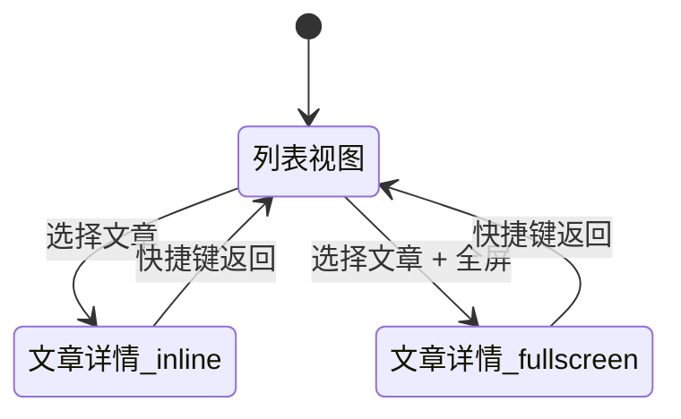
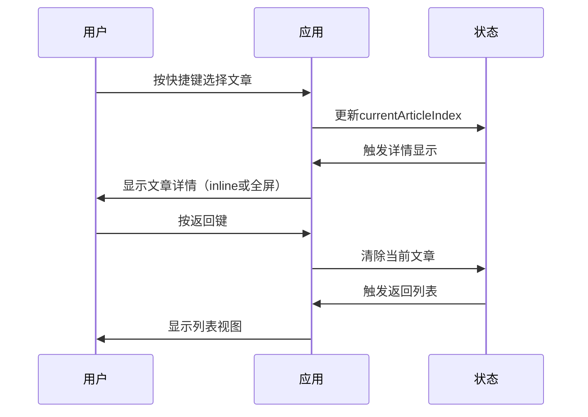

# Fresh RSS Reader 设计澄清文档

创建日期：2026-09-09
项目：fresh-rss-reader
文档类型：设计澄清
状态：已确认

---

## 1. 运行环境

- **决定**：继续基于 EAF 运行，不改为独立前端。
- **原因**：旧 rss-reader 已经停止更新，重新设计 fresh-rss-reader 的目的是为了得到更合理、更稳定的实现，并保持与父项目 EAF 的同步/兼容。
- **含义**：
  - 前端仍为嵌入在 EAF 中的 Web 视图（QWebEngine），Python 与前端之间的桥接仍围绕 EAF 的通信方式展开。
  - 重写的重点不在于换运行环境，而在于改进架构、交互模型、状态管理和对 EAF 变化的适配能力。
- **兼容 Doom Emacs 设计原则**：
  - 模块加载与配置方式上可被 Doom Emacs 采用统一的插件加载模式进行管理。
  - 键绑定设计上考虑与 Doom Emacs 键绑定体系的协调，避免与 Doom 的 Evil 键绑定模式或其他约定发生冲突。
  - 配置时能够自然地接入 Doom Emacs 的配置组织方式（例如 `config.el` 风格的加载、模块启用等）。
  - 主题、字体等 Emacs 环境设置对齐，让 fresh-rss-reader 在 Doom Emacs 下的视觉/操控体验与 Doom 的整体风格一致。

---

## 2. 范围边界

本次重写的目标不是无限扩展功能，而是重新设计 fresh-rss-reader。需要明确：这一版必须做什么、可能考虑但未必必须做什么。

### 2.1 核心必须功能（这一版必须做）

以下功能构成本版的最小必须范围：

1. **RSS feed 列表管理**
   - 添加 feed
   - 移除 feed
   - 展示 feed 列表
   - feed 基本信息展示（标题、订阅地址等）

2. **文章列表展示**
   - 展示当前选中 feed 的文章列表
   - 文章基本信息展示（标题、作者、时间、摘要等）
   - 文章已读/未读状态展示

3. **文章内容阅读**
   - 打开文章链接进行阅读
   - 文章内容展示

4. **已读标记**
   - 标记文章为已读
   - 已读状态在文章列表中展示

5. **OPML 导入/导出**
   - 从 OPML 文件导入 feed 列表
   - 将当前 feed 列表导出为 OPML 文件

### 2.2 可能考虑但未必必须的功能（可选，视版本而定）

以下功能可能在后续版本中考虑，不纳入本版必须范围：

- 文章保存/收藏
- 全文抓取（content extraction）
- 搜索功能
- 标签/分类
- 过滤规则
- 离线缓存
- 阅读历史/同步
- 阅读进度追踪
- 其它增强功能

### 2.3 旧 rss-reader 的处理

旧 rss-reader 可完全舍弃，不需要保留其功能。fresh-rss-reader 是重新设计的独立实现。

---

范围边界决定工程量、数据模型复杂度和后续迭代起点。本版聚焦于核心功能的合理实现，确保稳定性。

---

## 3. 交互模型中的"返回"路径

旧 rss-reader 的一个典型问题是：打开文章后缺少清晰且一致的返回 feed/news list 的命令与交互路径。fresh-rss-reader 需要在设计阶段就处理好这个问题。

### 3.1 已定决策

- **布局方式**：采用列表 + 详情的复合布局（同章）。列表与详情在同一个主视图内，根据需要进行显示切换。
- **全屏支持**：允许将文章详情切换为全屏显示，方便专注阅读。
- **返回方式**：通过快捷键返回列表。
- **交互语义**：
  - 快捷键是主要返回手段。
  - 全屏详情状态下，快捷键返回的目标是列表视图；从全屏退出后仍可在列表视图中继续浏览。
  - 文章详情不作为独立窗口/独立页面看待，而是在同一视图体系内切换显示状态。

### 3.2 设计意图

通过"列表 + 详情同章 + 允许全屏 + 快捷键返回"的模型，避免旧 rss-reader 中因打开文章后缺少明确返回命令而导致的卡顿/迷失问题。用户在任何详情状态下都应能通过快捷键清楚地回到 feed/news list。

交互模型决定前端视图结构、状态管理方式和命令体系设计。

---

## 图表

### 3.3 视图切换模型

### 3.4 交互流程

---

## 变更记录

| 日期       | 变更内容                        | 作者 |
|------------|--------------------------------|------|
| 2026-09-09 | 初始版本创建                    | -    |
| 2026-09-09 | 统一文档风格，补充图表和Changelog | -    |
