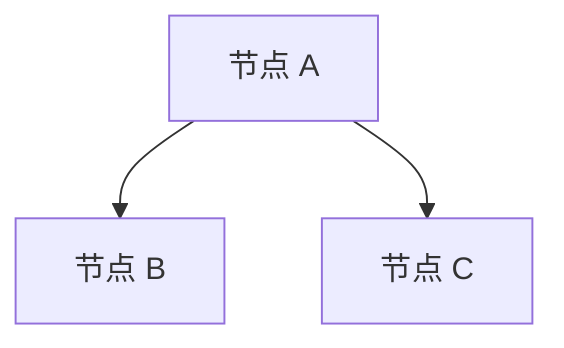

# 文档风格指南

创建日期：2026-09-09
项目：fresh-rss-reader
文档类型：风格指南
状态：初始版本

---

## 目的

本文档定义了 fresh-rss-reader 项目文档的统一风格规范，以确保所有文档在格式、结构、语言风格等方面保持一致。

---

## 元信息格式

所有文档的开头都应包含统一的元信息块：

```
创建日期：2026-09-09
项目：fresh-rss-reader
文档类型：设计澄清 / 架构设计 / 实现阶段 / 风格指南
状态：草案 / 确认 / 最终
相关文件：doc/architecture.md（如适用）
```

### 元信息字段说明

- **创建日期**：文档创建的日期，格式为 YYYY-MM-DD
- **项目**：项目名称，统一为"fresh-rss-reader"
- **文档类型**：文档的类型，包括：
  - 设计澄清：用于记录设计决策和澄清的问题
  - 架构设计：用于描述系统架构
  - 实现阶段：用于拆分实现步骤
  - 风格指南：用于定义文档规范
- **状态**：文档的当前状态，包括：
  - 草案：初稿，尚未确认
  - 确认：已确认，可以参考
  - 最终：最终版本，不再修改
- **相关文件**：与此文档相关的其他文档，如适用

---

## 标题层级

### 标题格式

- 文件标题使用一级标题 `#`
- 大章节使用二级标题 `##`
- 小节使用三级标题 `###`
- 更细的小节使用四级标题 `####`

### 标题风格

- 标题使用中文，避免使用英文标题
- 标题应语义化，避免使用数字编号（除非是特别长的技术规范）
- 标题应简洁明了，能够反映章节内容

### 示例

```markdown
# 文档标题（中文）

## 大章节（中文）

### 小节（中文）

#### 更细的小节（如需要，中文）
```

---

## 列表风格

### 列表项格式

- 定义项使用 `- **术语**：说明` 格式
- 普通项使用 `- 说明` 格式
- 子项使用 2 个空格缩进
- 嵌套子项使用 4 个空格缩进

### 示例

```markdown
- **术语 1**：说明 1
  - 子项 1.1
  - 子项 1.2
    - 嵌套子项 1.2.1
- **术语 2**：说明 2
- 普通项 1
- 普通项 2
```

### 注意事项

- 列表项之间保持空行，以增加可读性
- 列表项中的代码或路径使用反引号 `` ` `` 包围
- 避免列表项过长，适当换行

---

## 代码块风格

### 代码块格式

- 代码块应标示语言，例如 ` ```elisp `、` ```javascript `、` ```mermaid `、` ```python `、` ```css ` 等
- 代码块前后应空行，以增加可读性

### 示例

```markdown
```elisp
;; 这是一个 Elisp 代码示例
(defun example ()
  "示例函数"
  (interactive)
  (message "Hello, World!"))
```
```

### 注意事项

- 简单代码片段或路径可以使用行内代码 `` ` ``
- 代码块中的注释使用双斜杠 `//` 或分号 `;`，根据语言习惯
- 代码块中的字符串使用双引号 `"` 或单引号 `'`，根据语言习惯

---

## 表格风格

### 表格格式

- 表格使用 Markdown 表格语法
- 表头使用 `| 列名 | 列名 |` 格式
- 表头和表体之间使用 `|--------|------|` 分隔

### 示例

```markdown
| 列名 1 | 列名 2 | 列名 3 |
|--------|--------|--------|
| 单元格 1 | 单元格 2 | 单元格 3 |
| 单元格 4 | 单元格 5 | 单元格 6 |
```

### 注意事项

- 表格适用于对照表或比较信息
- 表格不适用于普通罗列，建议使用列表
- 表格列名应简洁明了，能够反映列内容

---

## 图表风格

### 图表格式

- 图表使用 mermaid 格式，并标示语言 ` ```mermaid `
- 图表放置在相关描述之后，作为视觉辅助

### 示例

```markdown

```

### 注意事项

- 图表应有标题或说明，以便读者理解
- 图表不宜过于复杂，保持清晰易懂
- 图表可以是流程图、状态图、序列图、关系图等

---

## 语言风格

### 语言选择

- 文档统一使用中文，避免夹杂英文术语（除非必要）
- 必要的英文术语应使用反引号 `` ` `` 包围，或在首次出现时进行解释

### 语气风格

- 文档语气偏向正式、客观的技术文档风格
- 避免过于口语化的表达
- 使用简洁明了的句子，避免冗长的句子

### 示例

```markdown
- **错误**：这个功能挺好用的，就是有时候会卡顿
- **正确**：此功能在某些情况下可能出现性能问题，需进一步优化
```

---

## 文档结构

### 通用结构

所有文档都应包含以下通用结构：

1. **元信息块**：位于文档开头
2. **文档标题**：使用一级标题 `#`
3. **主要内容**：根据文档类型组织
4. **图表**：如适用，放置在相关描述之后
5. **变更记录**：位于文档末尾
6. **附录**：如适用，位于变更记录之前

### 章节组织

- 根据文档类型组织章节
- 设计澄清文档：按主题组织（如运行环境、范围边界、交互模型）
- 架构设计文档：按架构层次组织（如前端架构、后端架构、通信架构）
- 实现阶段文档：按阶段组织（如阶段 1、阶段 2 等）

### 项目范围与约束

在项目进行中，应遵守以下约束：

- **不修改 EAF 源码**：不修改 EAF 核心源码，和其他 EAF 组件或上游项目的源码
- **仅限本项目目录**：所有实现都在 `fresh-rss-reader/` 目录内完成，不修改 EAF 核心文件或其他应用程序文件
- **依赖 EAF 接口**：通过 EAF 提供的公开接口（如 Buffer 体系、QWebChannel 等）进行集成，但不修改接口本身
- **允许通过公开注册机制集成**：允许使用 EAF 提供的公开注册机制（如 `eaf-app-binding-alist`、`eaf-app-module-path-alist` 等添加条目）来注册本应用的 keybinding、模块路径等

这一约束旨在明确项目边界，避免对父项目造成意外影响，同时也方便项目维护和独立开发。

---

## 变更记录格式

### 变更记录位置

变更记录位于文档末尾，前附录之后（如有附录）。

### 变更记录格式

```markdown
## 变更记录

| 日期       | 变更内容                                        | 作者 |
|------------|------------------------------------------------|------|
| 2026-09-09 | 初始版本创建                                    | -    |
| 2026-09-09 | 统一文档风格，补充图表和变更记录               | -    |
```

### 变更记录字段说明

- **日期**：变更发生的日期，格式为 YYYY-MM-DD
- **变更内容**：简要描述变更的内容
- **作者**：变更的作者，如 unknown 可用 `-` 表示

---

## 附录风格

### 附录位置

附录位于变更记录之前，如有附录。

### 附录内容

附录可以包含：
- 相关文档列表
- 名词解释
- 参考资料
- 其他补充信息

### 示例

```markdown
## 附录

### A. 相关文档

- 架构设计：`doc/architecture.md`
- 设计澄清：`doc/design-clarifications.md`

### B. 名词解释

- **EAF**：Emacs Application Framework
- **QWebChannel**：Qt 提供的 Python 与 JavaScript 通信桥梁
```

---

## 小结

本文档定义了 fresh-rss-reader 项目文档的统一风格规范，包括元信息格式、标题层级、列表风格、代码块风格、表格风格、图表风格、语言风格、文档结构、变更记录格式和附录风格。

所有撰写文档的人员应遵循本文档的规范，以确保文档风格的一致性。

---

## 变更记录

| 日期       | 变更内容                     | 作者 |
|------------|-----------------------------|------|
| 2026-09-09 | 初始版本创建                | -    |
